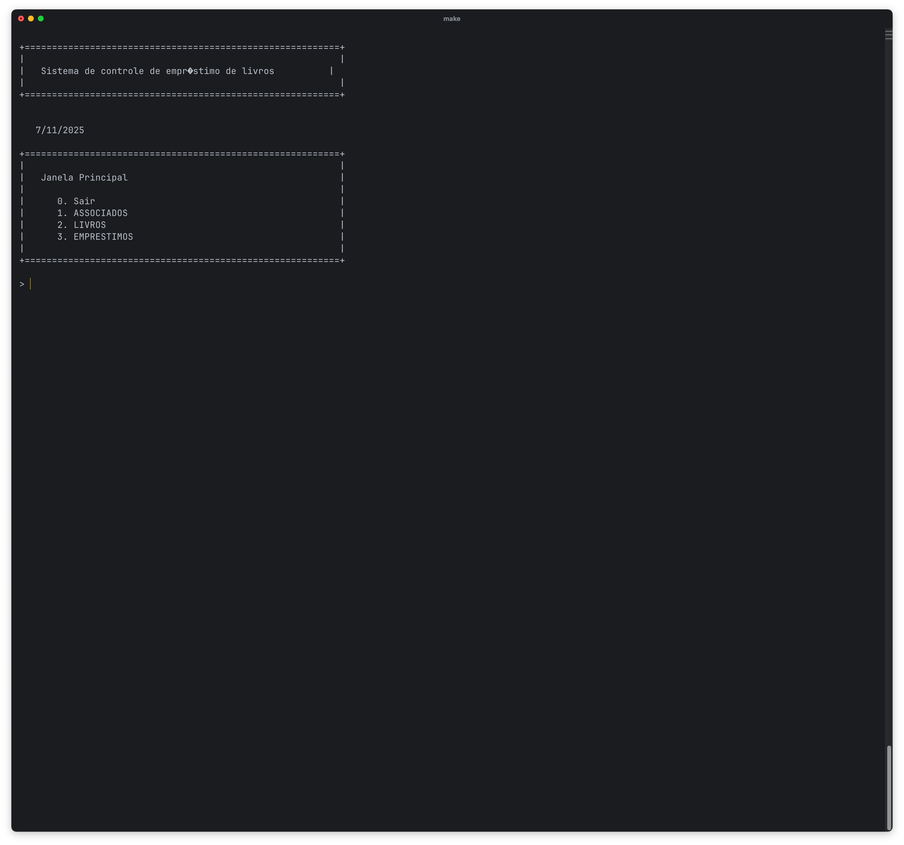
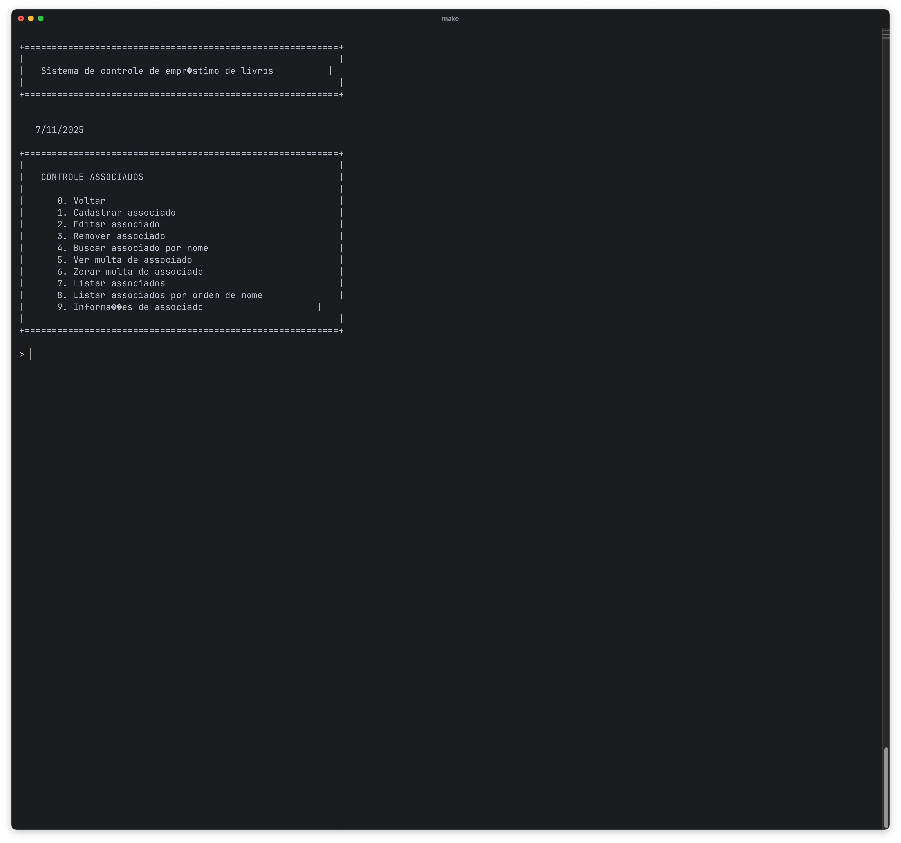
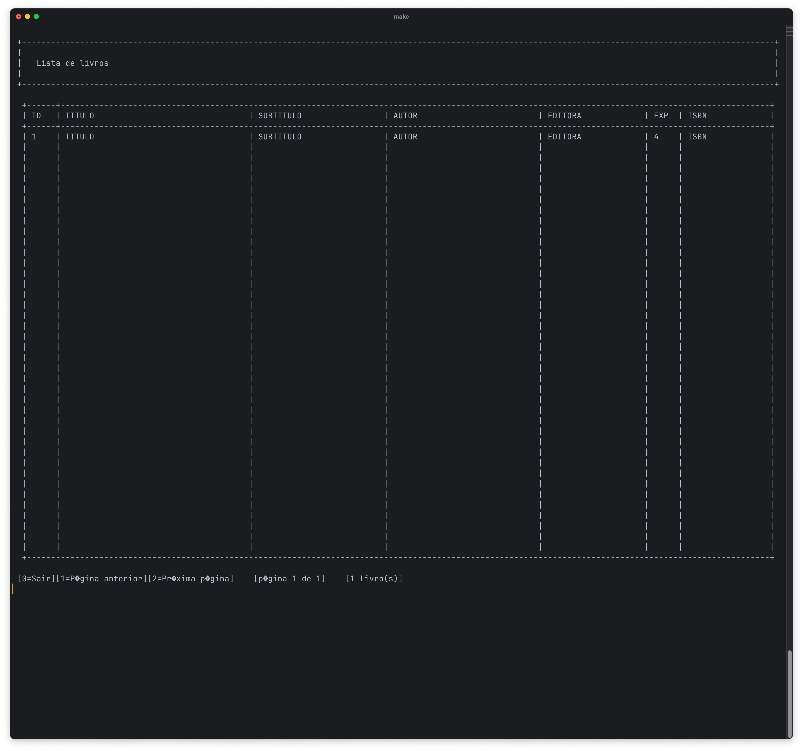

# Sistema Biblioteca

This is the original branch containing the original files from 2012.
This is a large, monolithic, text-only C99 application designed to manage book loans. It was originally created in 2011 and last updated in 2012 for a programming study case.

## Screenshots

## Branches

- original => Contains the original files from 2012.
- main => Contains a few improvements added later on.
